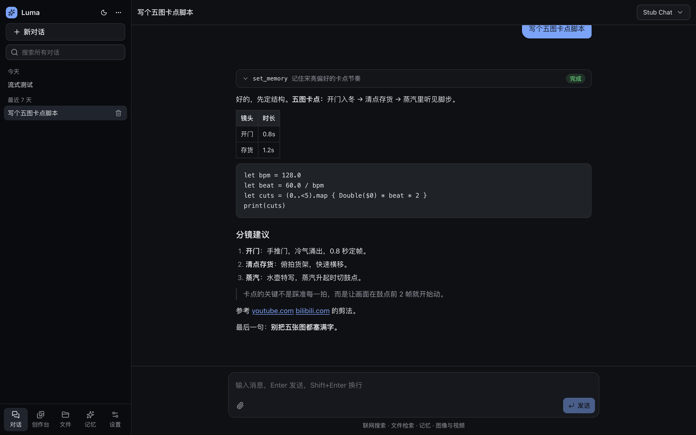
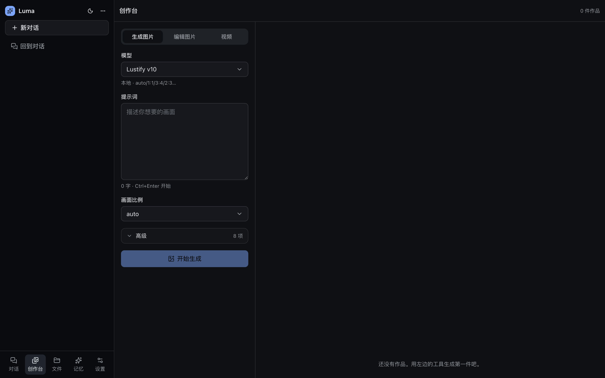
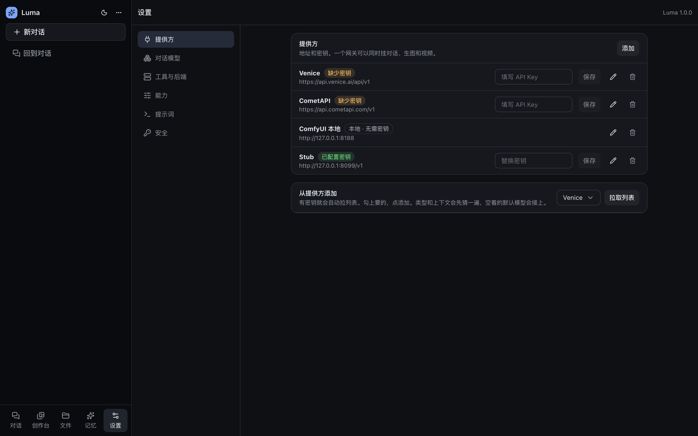
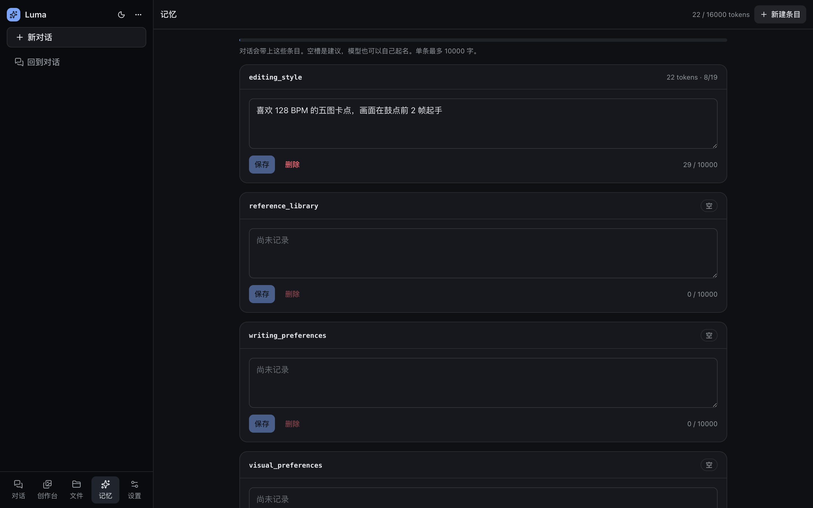
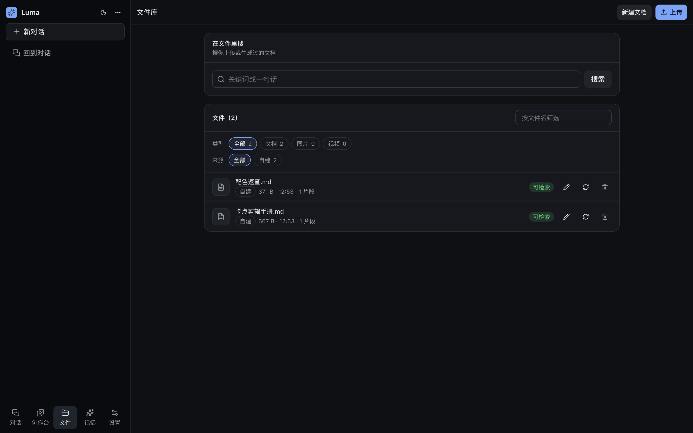
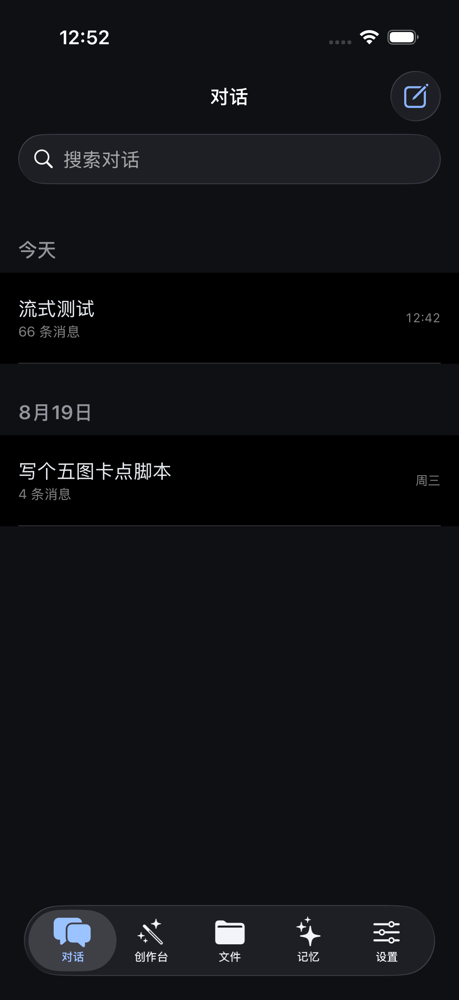
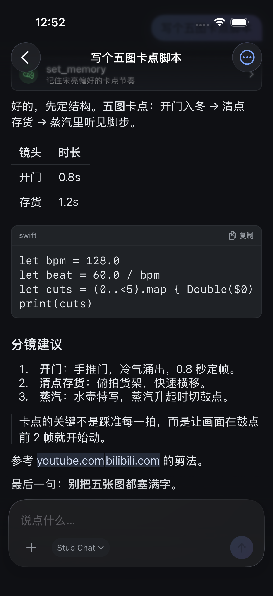
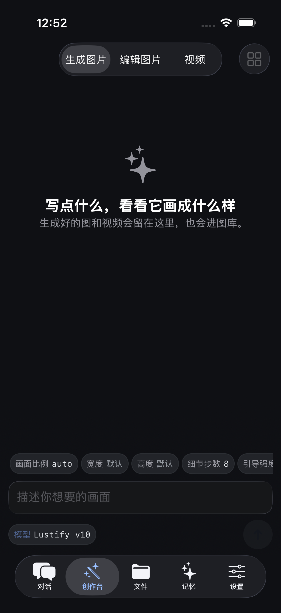
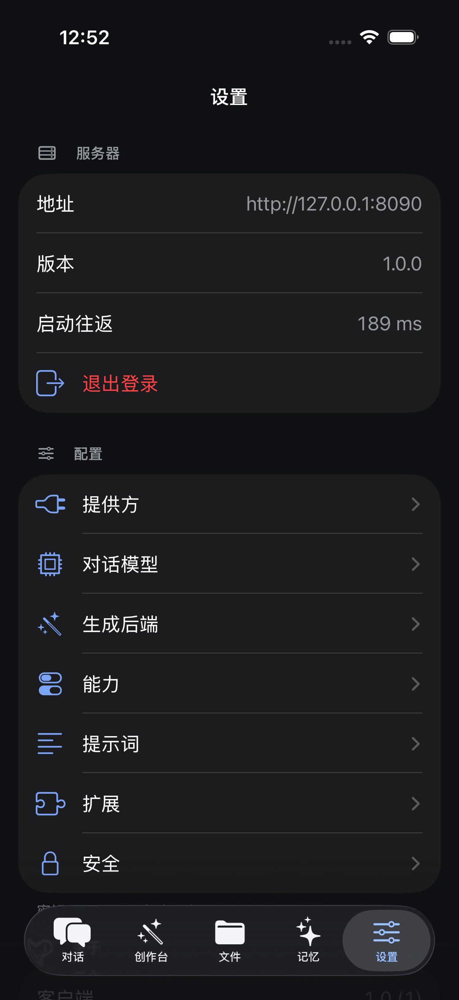

# Luma

自己的 agent，跑在自己的机器上。对话、画图、做视频、记事、查文件，都在一个地方。

有网页和 iOS 两个客户端，同一个服务、同一份数据，手机上开始的对话回电脑接着说。
没有账号体系，没有云端副本，也没有内容过滤——状态就是你机器上的一个目录。



---

## 它能做什么

**对话。** 流式回答，Markdown、表格、代码、公式、引用都渲染。工具调用是一个可以
展开的块，看得见 agent 到底做了什么。可以改自己发过的话重来，可以中途停，可以让
它接着写。

**画图和做视频。** 不是聊天的附属功能，是单独的创作台：文生图、图生图（改图）、
文生视频、图生视频。表单里的参数由后端自己描述，换个模型表单就跟着变。出的图和
视频进图库，点开能看到用了什么模型、什么参数、从哪张图改来的，可以一键复用。

**记忆。** 你说「记住我喜欢 128 BPM 的卡点」，它就记住，之后每轮都带着。也可以
自己在记忆页面直接改。

**文件。** 上传 PDF、Word、文本，自动切块索引，之后可以检索。随消息附上来的
文档，正文直接进这一轮上下文，不用它先去搜。

**联网搜索。** Tavily 或自建 SearXNG，可以搜网页、搜图、搜新闻，还能把前几条的
正文抓回来读。

**改代码、跑命令。** 限定在一个工作目录里，读、写、执行分别可开关，危险操作要你
在手机上点一下批准才继续。

**接别的工具。** MCP（stdio 或远程）挂进来就是 agent 的工具。

**后端随便换。** 一个「提供方」加一个「模型」就能接：OpenAI 兼容接口、Anthropic、
Gemini 原生、本地 llama、托管的生图生视频服务，或者本机的 ComfyUI。

---

## 界面

### 网页

<table>
<tr>
<td width="50%"><br><sub><b>创作台</b>：左边是后端自己描述的参数表单，右边是图库</sub></td>
<td width="50%"><br><sub><b>设置</b>：提供方、模型、能力、提示词、安全，都在界面里改</sub></td>
</tr>
<tr>
<td><br><sub><b>记忆</b>：key/value，带 token 预算</sub></td>
<td><br><sub><b>文件</b>：上传、笔记、检索、预览</sub></td>
</tr>
</table>

### iOS

<table>
<tr>
<td width="25%"><br><sub><b>对话</b></sub></td>
<td width="25%"><br><sub><b>转写</b>：工具块、表格、代码、引用</sub></td>
<td width="25%"><br><sub><b>创作台</b>：参数是一排可点的胶囊</sub></td>
<td width="25%"><br><sub><b>设置</b>：提供方、模型、密钥都能在手机上改</sub></td>
</tr>
</table>

iPhone 是底部五栏，iPad 是左侧导航加分栏。视频在转写、图库、文件库三个地方都能
直接播。

> 截图里的创作台和图库是空的、模型显示为 `Stub Chat`，因为拍摄这台机器上没有配
> 生成后端的密钥、也没装 ComfyUI。配好之后这两处就是作品网格。

---

## 推荐配置

### 服务端

跑 Luma 本身很轻——它只是一个 Node 进程加两个 SQLite 文件，几百 MB 内存足够。
真正吃资源的是你选的后端。

| | 最低 | 推荐 |
|---|---|---|
| 系统 | Windows / macOS / Linux | 同左 |
| Node | 24（服务端用 `node:sqlite`） | 24 LTS |
| 内存 | 2 GB | 8 GB |
| 磁盘 | 1 GB + 作品占用 | 视生成量而定，图和视频都留在本地 |

只用远程 API 的话，一台常年开着的小主机或 NAS 就够。

### 想在本机出图

要装 [ComfyUI](https://www.comfy.org/)，Luma 通过 `comfy-workflow` 走
`127.0.0.1:8188` 调它。这时候是显卡说了算：

| | 够用 | 舒服 |
|---|---|---|
| 显存 | 8 GB（SDXL 类、走加速工作流） | 16 GB 以上（大模型、视频） |

ComfyUI 只监听本机，不跟着隧道出去。它没启动时 Luma 照常用，只是绑了本地后端的
那个生成工具会失败，并在错误里说明该启动什么。

### 模型怎么选

- **对话**：挑一个上下文窗口大、支持工具调用的。窗口写在模型行上，压缩和预算按
  它算。
- **生图**：托管服务省事；要完全可控、不想付费、或者不希望内容经过别人的服务器，
  就用本机 ComfyUI。
- **检索**：想用语义搜索就配一组 embedding（单独的地址、模型、维度、切块大小）。
  没配也能用，关键词检索照常工作，只是块的状态停在「已索引」而不是「就绪」。
- **搜索**：Tavily 要密钥、功能全；SearXNG 自建、不要密钥，但只给摘要。

一个网关可以同时挂对话、生图和视频，不用为每种能力各加一个提供方。

---

## 使用方法

### 启动

**Windows** — 双击就行：

| 脚本 | 作用 |
|---|---|
| `一键启动-Luma.cmd` | 重建前端、拉起服务、预热 ComfyUI、开隧道、打印访问码 |
| `一键关闭-Luma.cmd` | 停服务、隧道、MCP 子进程和 ComfyUI |
| `显示-Luma访问码.cmd` | 从加密保险箱里读出访问码 |

**macOS / Linux**：

```bash
bash luma/scripts/start.sh --local   # 只听 127.0.0.1，不开隧道
bash luma/scripts/stop.sh
bash luma/scripts/show-code.sh       # 忘了访问码就跑这个
```

重复运行是安全的，启动脚本会先停掉上一个实例。

然后开 <http://127.0.0.1:8090/>，输入启动时打印的访问码。

### 配一遍

第一次进去先去**设置**：

1. **提供方** — 填地址和 API Key。密钥只提交，之后读不出来，界面只告诉你配没配。
2. **对话模型** — 点「拉取列表」从提供方自动拉，勾上要的批量添加；类型和上下文
   窗口会先猜一遍，不对可以改。
3. **生成后端** — 指定默认的生图、改图、视频各用哪个模型。对话里的 `generate_image`
   这些工具就走这三个。
4. **能力** — 搜索后端、embedding、记忆上限、代码工作目录，按需开关。关掉的能力，
   对应的工具不会出现在 agent 面前。
5. **提示词** — 全局提示词随仓库发布，clone 下来就生效，想改在这里改。

### 日常用

**聊天**：直接说。要它记住什么就说「记住…」。附件用回形针，图片它直接看得见，
文档正文进这一轮上下文。

**出图**：去创作台，选模型、写提示词、调参数、开始生成。出来的东西点开可以看
血缘（模型、参数、父图），「再来一张」「以此为源」都在那里。

**手机上**：装好 App，填服务器地址和访问码。远程访问建议走 Cloudflare Tunnel 或
Tailscale——隧道前记得设 `LUMA_TRUST_PROXY=1`，否则限流和 HTTPS 判断会失灵。

**安全**：设置里可以开 TOTP 两步验证、改访问码、踢掉其他设备。这几个操作要再验
一次身份。

### 编译 iOS 客户端

需要 Xcode 和 [XcodeGen](https://github.com/yonaskolb/XcodeGen)，最低 iOS 18：

```bash
cd luma/ios
xcodegen generate      # 加了新文件之后必须重跑，否则它不参与编译
open Luma.xcodeproj
```

---

## 技术

一个 Node 进程，端口 8090，同时提供 `/v1` 接口和网页静态包。数据是
`luma/data/` 下的两个 SQLite 文件加一个资源目录——删掉就等于出厂。

对话回合复用 [pi](https://www.npmjs.com/package/@earendil-works/pi-agent-core)
的 agent loop（会话树、压缩、流式、工具调度）；Luma 做外面那层：HTTP 生命周期、
消息投影、审批、工具装配、生成队列。

网页是 React + Vite，iOS 是 SwiftUI。两个客户端都只是 `/v1` 的消费者，谁也没有
私有端点——新能力先出现在服务端。

想往下看：[`luma/docs/00-product.md`](luma/docs/00-product.md) 是产品本身，
其余几份分别讲架构、agent、生成、能力、API 和客户端。

### 目录

```
luma/          全栈服务：API、网页、agent、工具、数据
ComfyUI/       本地生成后端（按机器安装，不在仓库里）
workflows/     可读的工作流导出，供在 ComfyUI 里手动打开参考
```

`runtime/`、`run/`、`ComfyUI/` 都按机器安装，仓库里没有它们不等于哪里坏了。

### 验证

```bash
cd luma
npm run typecheck   # 类型
npm run audit       # 十三项静态检查，不联网、不开端口、不碰 data/
npm run e2e         # 三十几项真实 HTTP 验收，要一个跑着的实例
```

iOS 那边 `xcodebuild test`：132 项单元测试加一套 UI 测试。可选的东西一律跳过而
不是失败——没有搜索密钥、ComfyUI 没启动、没配视频模型、库里没有视频可播，都不该
让测试变红。
